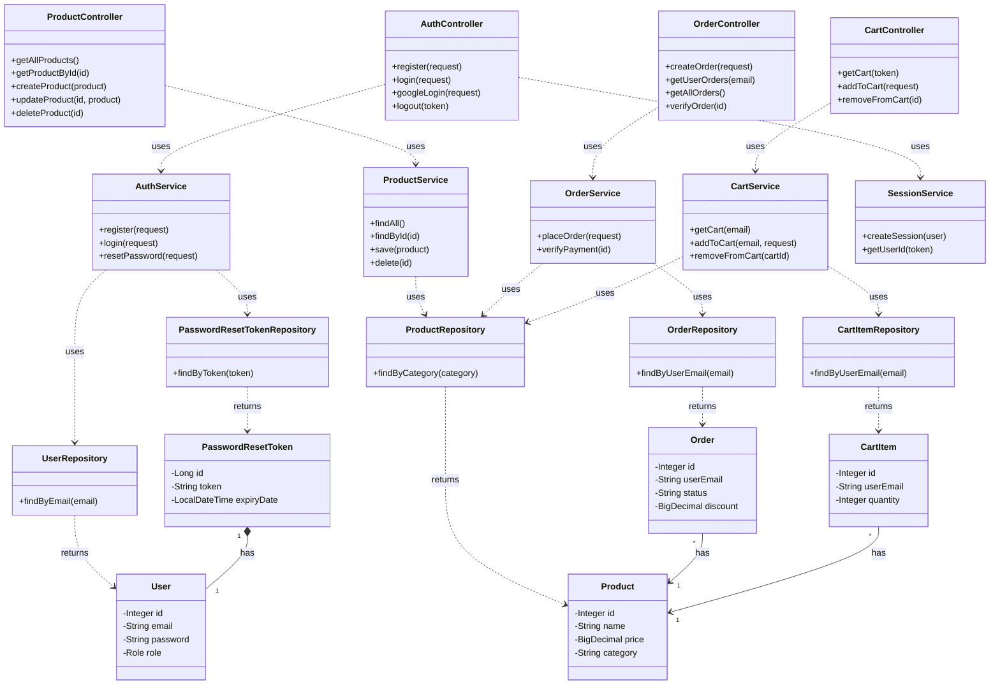
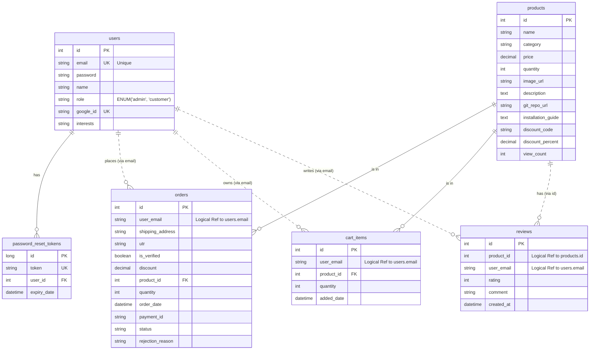

# System Diagrams

## 1. Class Diagram
This diagram illustrates the high-level object-oriented structure of the backend, showing how Controllers, Services, Repositories, and Entities interact.

## 2. Entity Relationship Diagram (ERD)
This diagram represents the database schema and the relationships between tables. Note that `orders`, `reviews`, and `cart_items` often reference `users` logically via `user_email` rather than a strict foreign key to `user_id`.

